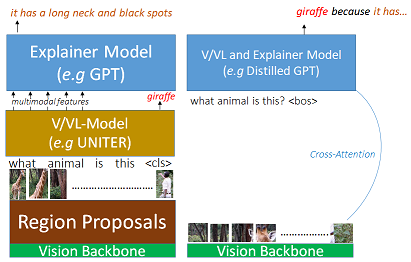

# NLX-GPT
Official Code for **NLX-GPT: A Model for Natural Language Explanations in Vision and Vision-Language Tasks**

<p align="center">

  </p>

### Requirements
- [PyTorch](https://pytorch.org/) 1.8 or higher
- [CLIP](https://github.com/openai/CLIP) (install with `pip install git+https://github.com/openai/CLIP.git`)
- [transformers](https://huggingface.co/docs/transformers/index) (install with `pip install transformers`)
- [accelerate](https://huggingface.co/docs/accelerate/index.html) for distributed training (install with `pip install git+https://github.com/huggingface/accelerate`)

### Images Download
We conduct experiments on 4 different V/VL NLE Datasets: **VQA-X, ACT-X, e-SNLI-VE** and **VCR**. Please download the images into a folder in your directory named `images` using the following links (our code *does not* use pre-cached visual features. Instead, the features are extracted directly during code execution):
<br>
- **VQA-X**: [COCO](https://cocodataset.org/#download) `train2014` and `val2014` images<br>
- **ACT-X**: [MPI](http://human-pose.mpi-inf.mpg.de/#download) images <br>
- **e-SNLI-VE**: [Flickr30K](http://shannon.cs.illinois.edu/DenotationGraph/) images <br>
- **VCR**: [VCR](https://visualcommonsense.com/download/) images <br>

### Annotations Download
We structure the annotations for the NLE datasets. You can dowloaded the structured annotations from here: [VQA-X](https://drive.google.com/drive/folders/16sJjeEQE2o23G-GGUi870ubXzJjdRDua?usp=sharing), [ACT-X](https://drive.google.com/drive/folders/1FffVDEgHmqnWiqD5-B5700gqErQ-3U1M?usp=sharing), [e-SNLI-VE](https://drive.google.com/drive/folders/16YyIbjOr0XAD-34sUFsmrsXxbD5aKTVf?usp=sharing), [VCR](https://drive.google.com/drive/folders/1Cpk0wngnnlW0zr_dfHvdR15Lec56HSZm?usp=sharing). Place them in `nle_data/dataset_name/` directory. `dataset_name` can be `{VQA-X, ACT-X, eSNLI-VE, VCR}`.
<br>
<br>
You also need [cococaption](https://github.com/tylin/coco-caption) and the annotations in the correct format in order to perform evaluation on NLG metrics. 
We use the cococaption python3 toolkit [here](https://github.com/ruotianluo/coco-caption/tree/ea20010419a955fed9882f9dcc53f2dc1ac65092). Please download it and place the `cococaption` folder in your directory. <br>
<br>
Then download the processed annotations in cococaption format from [here](https://drive.google.com/drive/folders/1b8kUPbgtEduiz8A_VbUg0W_vca7PyXsZ?usp=sharing) and place them in `cococaption/annotations`. <br>
<br>
Alternatively, you can create all the annotations yourself from the original files. Please follow the instructions in the `data` folder for that. <br><br>
For pretraining and concept detection, you need also data from the Visual Genome. Please see the `pretrain` folder for more information.

### Code
First please setup your distributed training environemnt. In your environment command line, type: <br>
```bash
accelerate config
```
and answer the questions. <br>
#### VQA-X 
Please run from the command line with: <br>
```bash
accelerate launch vqaX.py
```
Note: To finetune from the pretrained captioning model, please set the `finetune_pretrained` flag to `True`. 
#### ACT-X 
Please run from the command line with: <br>
```bash
accelerate launch actX.py
```
Note: To finetune from the pretrained captioning model, please set the `finetune_pretrained` flag to `True`. 

### Models
All models can be downloaded from the links below:
- VQA-X (w/o pretraining): [link](https://drive.google.com/drive/folders/187_WSQUSHNf1Ga9qrynbUR98jMlwl3NF?usp=sharing)
- VQA-X (w/ pretraining): [link](https://drive.google.com/drive/folders/1Bfc__0HRzYPyvRe0Ur_oSbhO8dSavT4e?usp=sharing)
- ACT-X (w/o pretraining): [link](https://drive.google.com/drive/folders/1b9fG54lm-PnXrPvYhnFe4T78gHrU93IS?usp=sharing)
- ACT-X (w/ pretraining): [link](https://drive.google.com/drive/folders/1oiPm9f5I7ZmvMVxkq9crCSH02qxizZ7_?usp=sharing)
- Concept Head + Wordmap (used in e-SNLI-VE w/ concepts): [link](https://drive.google.com/drive/folders/1Hnk5NVvP5SqC-DeJT-znqwGzpU796QQl?usp=sharing)
- e-SNLI-VE (w/o concepts): [link](https://drive.google.com/drive/folders/1A4NlhIWy5byrqEfbIeh7Mgdxh1WGOD2x?usp=sharing)
- e-SNLI-VE (w/ concepts): [link](https://drive.google.com/drive/folders/1q4C9jujdHgXkc5IEsBD1HxAiVm4f8zp1?usp=sharing)
- VCR: [link](https://drive.google.com/drive/folders/1ApplfjJjQ-eLz8zjcf4iT1OSs0mY1dmk?usp=sharing)<br>
Note: Place the concept model and its wordmap in a folder: `pretrained_model/`

### Results 
The output results (generated text) on the test dataset can be downloaded from the links below. `_filtered` means that the file contains only the explanations for which the predicted answer is correct. 
`_unfiltered` means that all the explanations are included, regardless of whether the predicted answer is correct or not. 
`_full` means the full output prediction (inclusing the answer + explanation). `_exp` means the explanation part only. All evaluation is performed on `_exp`. 
See section 4 of the paper for more details. 
- VQA-X (w/o pretraining): [link](https://drive.google.com/drive/folders/10TR-cWJCGauU9i7FOAQWp2N3XTNWM_V6?usp=sharing)
- VQA-X (w/ pretraining): [link](https://drive.google.com/drive/folders/1nipKCftK2uSfBarrIrQYCnylpje8G9W_?usp=sharing)
- ACT-X (w/o pretraining): [link](https://drive.google.com/drive/folders/1vQN6rAzHGU12ikxKe7e4dGzm1okpZG9a?usp=sharing)
- ACT-X (w/ pretraining): [link](https://drive.google.com/drive/folders/1c_mlTc9HH_P0qMcu-mnQXAglbDNP2mNw?usp=sharing)
- e-SNLI-VE (w/o concepts): [link](https://drive.google.com/drive/folders/1rfgYyf9-8N2d3Jk-H6jWLtV0ii3tLqEF?usp=sharing)
- e-SNLI-VE (w/ concepts): [link](https://drive.google.com/drive/folders/1ex8JXxFF9D02WlI6qkCmryxmQXAlNKX_?usp=sharing)
- VCR: [link](https://drive.google.com/drive/folders/1Fp1xHux3GD8qdg7a2FQBHDdnPbw6MQL6?usp=sharing)

### Proposed Evaluation Metrics
Please see `explain_predict` and `retrieval_attack` folders.
