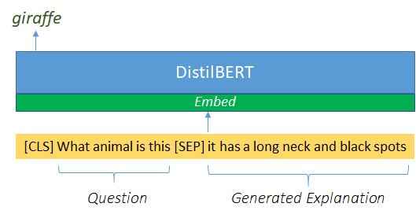

<p align="center">

  </p>

### Pretrained Models 
You can download the DistilBert Explain-Predict models from the link below, trained on the ground-truth explanation-answer pairs. Then you can directly evalaute the NLE model by feeding the generated output explanation.
<br>
- **VQA-X**: [link](https://drive.google.com/drive/folders/1dN2VLOcrSAxSaAzKqLou6ahizZscc9bw?usp=sharing)<br>
- **ACT-X**: [link](https://drive.google.com/drive/folders/1a8yMW-vSGiQnDUJmVgXxKxs9BV_l5WWN?usp=sharing)<br>
- **e-SNLI-VE**: [link](https://drive.google.com/drive/folders/1gjGpxWud6Jl3Zy-vo_uiReC_RBTGcPKq?usp=sharing)<br>

### Code
The code includes both training the model on the ground-truth explanation-answer pairs, as well as evaluating the generated output explanation. You can either train the model yourself or use the pretrained models in the links above (in this case use the very last part of the code). Training is a one-time process and is general to all NLE models for a given task. Please download the structured data and answer dictionary from here: [VQA-X](https://drive.google.com/drive/folders/1y90PPjP2bz2y5djH0tg9cvr1mIJ7hw-o?usp=sharing), [ACT-X](https://drive.google.com/drive/folders/1AGpMqc052IYfKCuan5CPpMb86LdOenRF?usp=sharing), [e-SNLI-VE](https://drive.google.com/drive/folders/1mABE8eTn6KUeVjAoPEEUxkoPuKVdhlET?usp=sharing). Alternatively, you can create them yourself (see `prepare data` folder). Although we restructure the data and create another file, this is only done for convinience. The content of these files are identical to the explanation-answer ground-truth pairs (for training) and the generated output explanation from the NLE model (for testing).

```bash
python ep_vqaX.py
python ep_actX.py
python ep_esnlive.py
```
