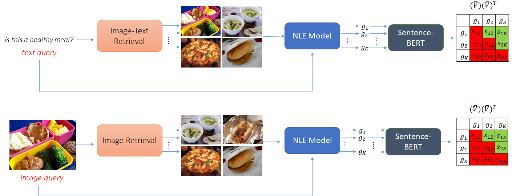

### Requirements
Please install [sentence transformers](https://github.com/UKPLab/sentence-transformers) with `pip install -U sentence-transformers`

<p align="center">

  </p>
  
### Retrieved Elements 
  
 The retrieved elements (image or text) for each dataset can be downloaded from the links below. Alternatively, you can create them yourself. For that, please see folder `retrieval`). All files should be placed in this folder (`retrieval_attack`). Each file is structured as a dictionary with the key being the query and the value being the retrieved elements. 
 - **VQA-X**: [link](https://drive.google.com/drive/folders/138NiRv_baBcwX1K5JS6XcRnXakElAuIV?usp=sharing)
 - **ACT-X**: [link](https://drive.google.com/drive/folders/1tPxlLzFBWnvGa5uv_HygAKoryN1_dHpr?usp=sharing)
 - **e-SNLI-VE**: [link](https://drive.google.com/drive/folders/143hpHgmIRdcjj2gnD-ywI9AVdi5JE4sO?usp=sharing)

### Code
Please run with:
```bash
python ra_vqaX.py
python ra_actX.py
python ra_esnlive.py
```

